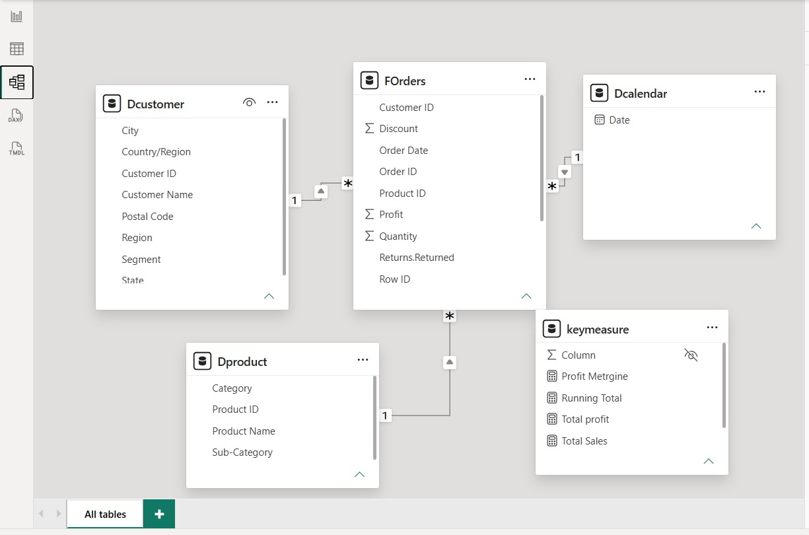
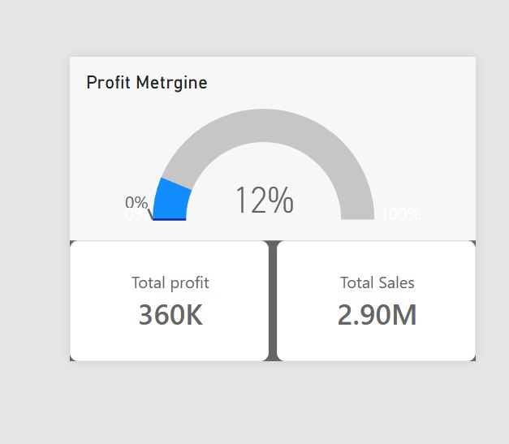

# 📊 Mohammed Eid Gaber Abbas

### Data Analyst | Accounting & Financial Reporting | Business Intelligence

<p align="center">
  <a href="https://www.linkedin.com/in/mohammed-eid-95081b388/">
    
  </a>
  <a href="mailto:mohammedeid5095@gmail.com">
    
  </a>
  <a href="Mohammed_Eid_Gaber_Abbas_CV.pdf">
    
  </a>
  
  
</p>

---

## 📌 Executive Summary

> *"Turning business and financial data into clear insights, interactive dashboards, and decision-ready reports."*

Financial Accounting student at **Beni-Suef University's Faculty of Commerce** (Expected Graduation: **2027**), combining **Data Analytics, Business Intelligence, and Accounting & Financial Reporting**.

Proficient in **Excel, SQL, Python, Power BI, and Tableau** to transform raw transactional and financial records into clean models, interactive dashboards, and actionable insights. Skilled in KPI reporting and data visualization that support management decision-making.

**Target Opportunities:** Junior Data Analyst | Financial Data Analyst | Business Intelligence Analyst.

---

## 🛠️ Technical & Business Competencies

| Domain | Tools & Technologies | Applied Competencies |
| :--- | :--- | :--- |
| **Data Analytics** | `Microsoft Excel`, `SQL`, `Python` | Tabular Modeling, Advanced Queries, Joins, Aggregations, Pandas, Data Cleansing |
| **Business Intelligence** | `Power BI Desktop`, `Tableau` | Kimball Star Schema Modeling, DAX Measures, Slicers, Cross-Filtering, Visual Hierarchy |
| **Business & Finance** | `Financial Accounting`, `Reporting` | Financial Statements, Income Statements, Balance Sheets, Variance Analysis, KPI Scorecards |

---

## 🚀 Featured Portfolio Projects

### 1. 📈 Sales Store Analytics Dashboard — Power BI
>
> **Technology Stack:** Power BI Desktop · Kimball Star Schema · DAX Measures · Interactive Visual Slicers

An interactive, multi-dimensional retail business intelligence report engineered to monitor corporate sales volume, profitability trajectories, and regional performance distributions.

#### 🖥️ Dashboard Overview


#### 🧩 Relational Data Model (Kimball Star Schema)



#### 🎯 Executive Target Gauge Visual

<p align="center">
  
</p>

#### 🔍 Technical & Analytical Highlights

- **Relational Architecture:** Built using a Kimball Star Schema connecting the central transactional fact table (`FOrders`) via 1-to-many relationships to three dedicated dimension tables (`Dcustomer`, `Dproduct`, `Dcalendar`).
- **Dedicated Measures Table (`keymeasure`):** Engineered custom DAX calculations including:
  - `Total Sales` ($575.46K actual / $2.90M target benchmark)
  - `Total Profit` ($52K actual / $360K target)
  - `Profit Margin %` (9% actual / 12% target gauge)
  - `Running Total by Month` and `Year by Year Sales Growth %`
- **Multi-Level Slicers:** Enabled real-time cross-filtering across **Years** (`2016`–`2020`), **Regions** (`West`, `Central`, `East`, `South`), and **Customer Segments** (`Consumer`, `Corporate`, `Home Office`).
- **Actionable Insights:**
  - **West Region** accounts for the largest sales contribution (**35.05%**), followed by Central (**24.75%**), East (**21.51%**), and South (**18.69%**).
  - **Technology** represents the highest profit generator, whereas **Furniture** operates on tighter margin parameters, guiding management in resource allocation.

---

### 2. 📑 Excel Data Analysis & Reporting Dashboard — Microsoft Excel
>
> **Technology Stack:** Microsoft Excel · Dynamic PivotTables · PivotCharts · Interactive Slicers · Financial Formulas

An Excel-based analytical dashboard designed to clean, structure, and model transactional sales data, providing management with clear operational visibility and profit margin variance reports.

#### 📊 Excel Sales Dashboard


#### 🔍 Technical & Analytical Highlights

- **Interactive Pivot Slicers:** Parameterized filtering by **Segment** (`Consumer`, `Corporate`, `Home Office`) and **Region** (`East`, `South`, `West`).
- **Customer Segmentation:** Analyzes customer volume distribution across client tiers (e.g., Corporate client count: **510**).
- **Monthly Demand Velocity:** Tracks temporal sales from January through December, identifying high seasonal peaks in **November**.
- **Category Profit Margin Analysis:** Directly contrasts category performance:
  - **Technology:** `15.61%` average profit margin
  - **Office Supplies:** `13.80%` average profit margin
  - **Furniture:** `3.88%` average profit margin
- **Decision Support:** Demonstrates how financial accounting logic can be structured inside Excel to guide periodic reviews, inventory forecasting, and cost control.

---

## 🎓 Education & Professional Development

### 🏛️ Beni-Suef University — Faculty of Commerce

- **Degree:** Bachelor of Commerce, Financial Accounting
- **Location:** Beni Suef, Egypt
- **Expected Graduation:** 2027
- **Academic Foundation:** Financial Accounting, Ledger Structures, Financial Statement Preparation, Commercial Law, Economics.

### 🌟 Professional Development Programs

- **Digital Egypt Youth (DEY) Initiative & Digital Egypt Pioneers Initiative (DEPI):**
  - High-impact national initiative enhancing technical and career capabilities in **Data Analytics** and **Business Intelligence**.
  - Practical execution in relational database querying (SQL), Python analytical scripting, and enterprise dashboard reporting (Power BI & Tableau).

---

## 🌐 Languages

- **Arabic:** Native
- **English:** Good / Professional Working Proficiency

---

## 📂 Project Repository Structure

```text
├── index.html                           # Complete responsive personal portfolio website
├── README.md                            # Professional GitHub documentation
├── Mohammed_Eid_Gaber_Abbas_CV.pdf      # Official verified PDF Curriculum Vitae
├── WhatsApp Image 2026-10-05 at 9.42.14 PM.jpeg  # Candidate official portrait photo
├── css/
│   └── style.css                        # Design system, dark/light themes, animations
├── js/
│   └── main.js                          # Navigation, interactive widgets, modals, lightbox
└── img/                                 # Project screenshots & architectural visuals
    ├── WhatsApp Image 2026-10-05 at 10.03.29 PM.jpeg      # Power BI Dashboard View
    ├── WhatsApp Image 2026-10-05 at 10.03.30 PM.jpeg      # Power BI Star Schema Model
    ├── WhatsApp Image 2026-10-05 at 10.03.29 PM (1).jpeg  # Power BI KPI Target Gauge
    └── WhatsApp Image 2026-10-05 at 10.04.54 PM.jpeg      # Microsoft Excel Dashboard
```

---

## 📬 Contact & Connect

- **Email:** [mohammedeid5095@gmail.com](mailto:mohammedeid5095@gmail.com)
- **Phone / WhatsApp:** `01202294465` / `+20 120 229 4465`
- **LinkedIn Profile:** [linkedin.com/in/mohammed-eid-95081b388](https://www.linkedin.com/in/mohammed-eid-95081b388/)
- **Live Portfolio:** Open `index.html` in any web browser.

---
*© 2026 Mohammed Eid Gaber Abbas. All rights reserved.*
